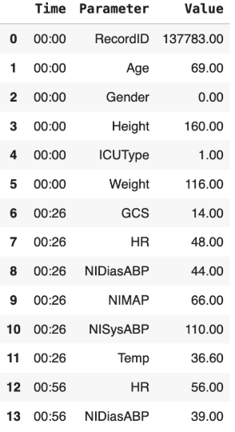

# Predicting Mortality of ICU Patients

**Alexander Ye**

Deep learning models for predicting ICU patient mortality from irregularly-sampled multivariate time-series data. The primary model implements the **STraTS** (Self-supervised Transformer for Time-Series) architecture, which uses a triplet representation technique to avoid time discretization and missing value imputation.

## Dataset

**Source:** [PhysioNet 2012 Computing in Cardiology Challenge](https://physionet.org/content/challenge-2012/1.0.0/)

Each patient has a CSV file of clinical observations recorded during their ICU stay:



- **Training set:** ~4000 patients (set-a)
- **Test set:** ~4000 patients (set-b)
- **Class distribution:** ~14% mortality (imbalanced)
- **Study window:** Hours 1-36 of ICU stay, predict at hour 48
- **Features:** 6 static variables (Age, Gender, Height, Weight, ICUType, RecordID) and 32 time-series variables (vitals, labs, blood gas, electrolytes, etc.)

## Project Structure

```
icu-mortality/
├── src/
|   ├── config.py               # Configurations 
│   ├── common/
│   │   ├── io.py               # Shared I/O functions
│   │   └── metrics.py          # Common metrics for evaluation
│   ├── baseline/
│   │   ├── train.py            # Main training and evaluation loops
│   │   ├── models.py           # GRU, LSTM, Transformer baselines
│   │   ├── utils.py            # Helper functions for baesline models
│   │   └── preprocess.py       # One time data preprocessing
│   └── strats/
│       ├── train.py            # Main training and evaluation loops
│       ├── dataset.py          # Custom triplet dataset/dataloader
│       ├── model.py            # STraTS model implementation
│       └── utils.py            # Triplet preprocessing functions
│       └── preprocess.py       # One time data preprocessing
├── data/
│   ├── raw/                    # PhysioNet raw patient CSVs & outcomes
│   ├── baseline/               # Preprocessed .pt tensors (standard imputation)
|   └── triplet/                # Preprocessed .pt tensors (triplet form)
|
└── images/                     # For README
```

## Approaches

### 1. Baseline: Hourly Aggregation

Standard approach that discretizes time and imputes missing values:

- Aggregate observations by hour into a fixed (36, 33) matrix per patient
- Median imputation for variables recorded at least once; -1 for never-recorded variables
- No feature standardization

The training set was subsequently broken down into 85% train and 15% validation. 

**Baseline Results:**

|  | GRU | LSTM | Transformer |
|---|---|---|---|
| AUROC | 0.7750 | 0.7977 | 0.7918 |
| AUPRC | 0.3840 | 0.4117 | 0.3913 |


### 2. STraTS: Triplet Representation 

Inspired by [STraTS](https://arxiv.org/abs/2107.14293) and TransEHR, this approach represents each clinical observation as a triplet **(t, f, v)** — time, feature ID, and value — eliminating the need for time discretization and imputation.

**Architecture:**

```
Triplets (time, feature_id, value)
    │
    ├── Time  → CVE (continuous value embedding, 2-layer FFN with tanh)
    ├── Value → CVE
    └── Feature → Learned embedding lookup
    │
    ▼ (sum)
Triplet Embeddings → Transformer Encoder (multi-head self-attention, masked)
    │
    ▼
Fusion Attention (weighted aggregation over time steps)
    │
    ├── + Demographics (linear projection of normalized static features)
    │
    ▼
Classification Head → Mortality Probability
```

**Key design choices:**
- **Continuous Value Embedding (CVE):** One-to-many FFN with 1 input neuron, $\sqrt{d}$ hidden neurons with $\tanh$ activation, and $d$ output neurons — embeds scalar time and value into dense vectors
- **Fusion attention:** Custom attention layer that computes a weighted sum over transformer outputs, handling variable-length sequences via masking
- **Z-score normalization:** Per-feature normalization computed on training set — this proved critical for model convergence

**Current Results:**
On the test set

| | STraTS |
|---|---|
| AUROC | 0.8394 |
| AUPRC | 0.4912 |


### Project Dependencies

- Python 3.12+
- PyTorch
- pandas, numpy
- scikit-learn
- tqdm

### Data Preparation

1. Download the [PhysioNet 2012 dataset](https://physionet.org/content/challenge-2012/1.0.0/) and place `set-a/`, `set-b/`, `Outcomes-a.txt`, and `Outcomes-b.txt` in `data/raw/`.

2. Run preprocessing:
   ```bash
   python src/preprocess.py
   ```
   This creates triplet tensors, labels, feature mappings, and normalization statistics in `data/_processed/`.

### Training

**STraTS model:**
```bash
python src/main.py --hidden_dim 64 --num_layers 2 --num_heads 4 --batch_size 32 --lr 0.001 --epochs 10
```

**Baseline models:** 
```bash
python -m baseline.train --model lstm --epochs 50
```

## Evaluation

Models are evaluated with threshold-independent metrics:
- **AUROC** — area under the ROC curve
- **AUPRC** — area under the precision-recall curve (emphasized given ~14% mortality rate)

## Lessons

- **Z-score normalization is essential.** Without per-feature normalization, the STraTS model fails to converge. Clinical variables span vastly different scales (e.g., heart rate ~60-100 vs. pH ~7.35-7.45).
- **AUPRC is more informative than AUROC** for imbalanced clinical datasets — a model predicting "alive" for everyone achieves ~0.86 accuracy but is clinically useless.